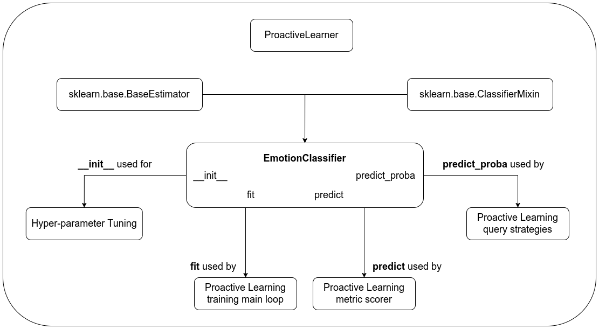

# Introduction
Emotion detection in U.S. Congressional Hearings.


# Installation

Run the following command to install the dependencies. It is recommended that you setup
a Python virtual environment for this project.

```commandline
pip install -r requirements.txt
```

If you would like to generate the documentation, then please install `doxygen` and `doxypy`
via your system's package manager.


# Data

The data is available in the `data` folder. It contains the original
20 U.S. Congressional Hearings data from Ferracane et al. (2021) as the file
`expanded_with_features_annotated_questions_responses_gold.csv`. The emotion
labels from the current annotations is saved in the file
`emotion_data_annotated_by_humans.csv`.


# Run

Run the code as follows:

```commandline
cd code
python proactive_learning.py
```

`proactive_learning.py`: This emulates the Proactive Learning technique proposed by
                         Donmez and Carbonell, 2008. It uses the toy dataset to emulate this 
                         Proactive Learning technique. It uses the modAL (Danka and Horvath, 2018) Python library
                         as the Active Learning framework and builds on top of that.
                         NOTE: This code is still a work-in-progress and doesn't completely 
                         cover all aspects of the Proactive Learning technique yet.

On the other hand, if you would like to run the exploratory data analysis Jupyter notebook, then
run the following command:

```commandline
cd code
jupyter notebook Exploratory_Data_Analysis.ipynb
jupyter notebook Exploratory_Data_Analysis_Survey.ipynb
```

Once the Jupyter notebook is open, run `Kernel -> Restart & Run All` to re-run all the analysis.
This analysis ia a work-in-progress as we complete the various parts
of the project.

If you would like to generate the documentation, then run the following command:

```commandline
./generate_documentation.sh
```


# Architecture




# References

E. Ferracane, G. Durrett, J.J. Li, and K. Erk. 2021. Did they answer? subjective acts and intents in conversational discourse. In Proceedings of the 2021 Conference of the North American Chapter of the Association for Computational Linguistics: Human Language Technologies, pages 1626–1644, Online. Association for Computational Linguistics.

P. Donmez and J.G. Carbonell. 2008. Proactive learning: Cost-sensitive active learning with multiple imperfect oracles. In Proceedings of the 17th ACM Conference on Information and Knowledge Management, CIKM'08, page 619–628, New York, NY, USA. Association for Computing Machinery.

T. Danka and P. Horvath. 2018. modAL: A modular active learning framework for Python. Available on arXiv at https://arxiv.org/abs/1805.00979.

# Acknowledgements

We would like to thank [Research Computing at the Rochester Institute of Technology](https://doi.org/10.34788/0S3G-QD15) for providing the computing resources for the project.
